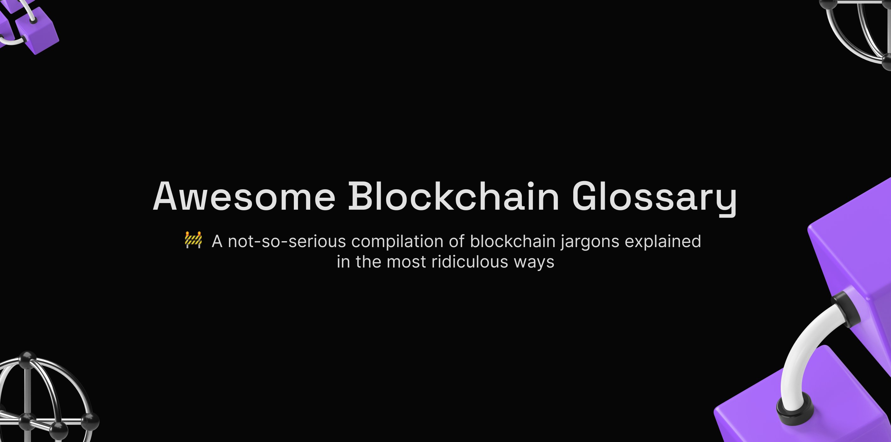

# awesome-blockchain-glossary

🚧 A not-so-serious compilation of blockchain jargons explained in the most ridiculous and simple way.

## Description

The blockchain world right now is a hot bowl of funny looking words. Funny looking words with really long convulated and terse meaning. I find it easy to understand a concept if it is explained with `everyday things`and `Analogies`. This hopes to serve as a lubricant to ease new blockchain devs into the ecosystem. I hope it matters.

Please, give this project a star ⭐. It is free.

## Table of Contents

- [awesome-blockchain-glossary](#awesome-blockchain-glossary)
  - [Description](#description)
  - [Table of Contents](#table-of-contents)
  - [Usage](#usage)
    - [✔️ How to use](#️-how-to-use)
    - [✔️ Are you learning blockchain concepts?](#️-are-you-learning-blockchain-concepts)
    - [✔️ I Want to contribute to Open Source](#️-i-want-to-contribute-to-open-source)
  - [Glossary](#glossary)
    - [🏴 Blockchain](#-blockchain)
    - [📒 Solidity](#-solidity)
  - [Contribution](#contribution)
  - [License](#license)

## Usage

### ✔️ How to use

Use your browser search feature to quickly find the definition you are intrested in.

### ✔️ Are you learning blockchain concepts?

 Good! Then you are perfect. Use the search feature in your browser to find what ever term you need to understand. Get the good stuff without lumps.

 Wait, hold up! If you are learning blockchain development, you could also contribute to this project no matter what level of development you are. Look at the [Contributing guidelines](docs/contributing.md), or as i like to refer to it [`The Onboarding station`](docs/contributing.md), for easy steps to do this.

### ✔️ I Want to contribute to Open Source

No fuss. That's Cool! Here is one. Read the [Contributing guidelines](docs/contributing.md) to get started.

## Glossary

### 🏴 Blockchain

- [Blockchain](glossary/Blockchain/Blockchain.md)
- [DEFI](glossary/Blockchain/DEFI.md)

### 📒 Solidity

- [Solidity](glossary/Solidity/Solidity.md)

## Contribution

We are happily waiting for your shiny new contribution.
Make a quick stop at the Onboarding station to learn how best to contribute.
Onboarding station --> [Contribution Guidelines](docs/contributing.md)

## License

[Creative Commons](LICENSE)